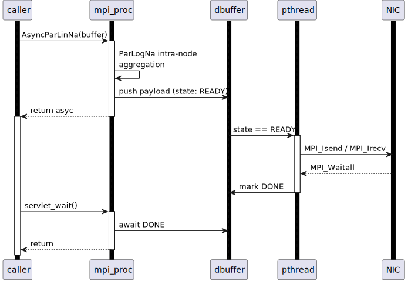
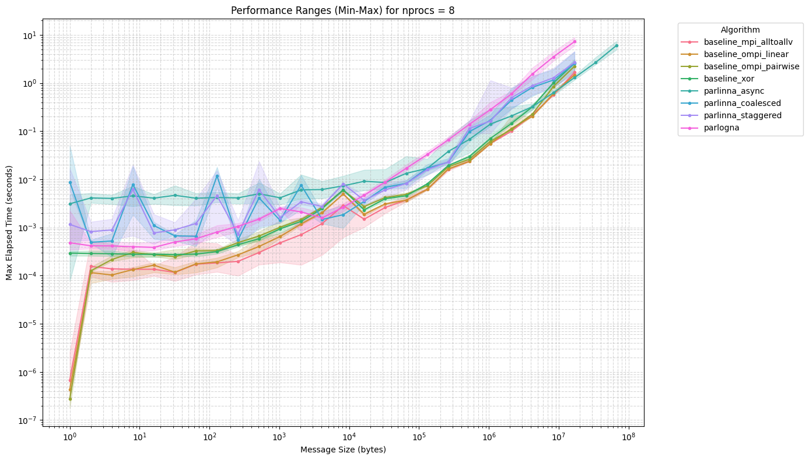
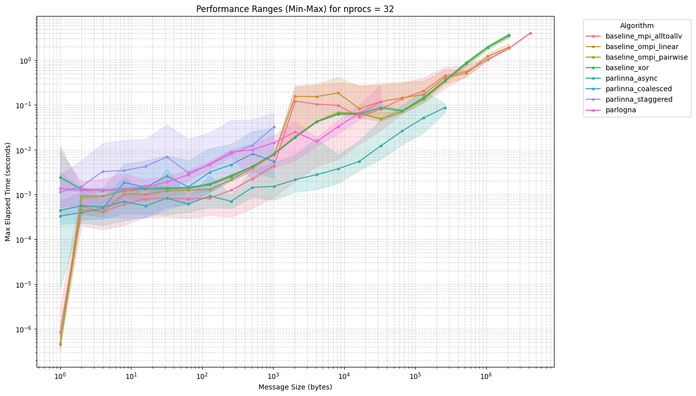
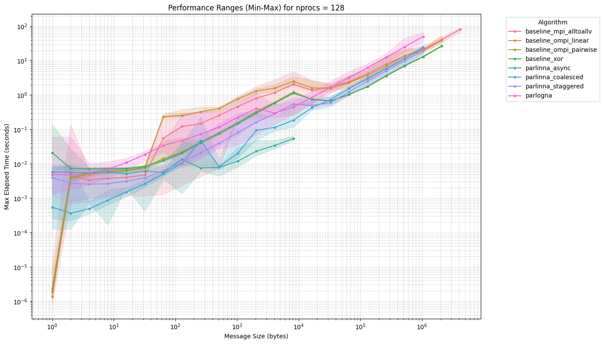
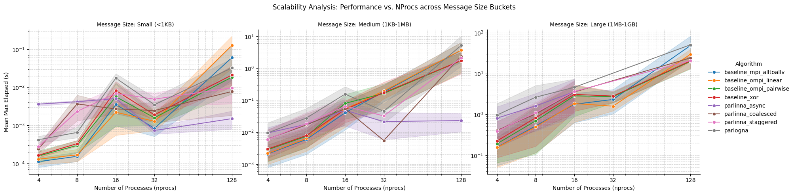

# Asynchrony and Overlap for Parameterized Non-Uniform All-to-All

Asynchrony and overlap for a novel non-uniform all-to-all communication algorithm [ParLinNa (parameterized linear non-uniform all-to-all, Ke Fan et al)](https://doi.org/10.48550/arXiv.2411.02581) 

## Project Overview

The *ParLinNa* algorithm splits the non-uniform all-to-all MPI communication into 2 phases: intra-node and inter-node This project aims to extends the ParLinNa algorithm architecture to support a dedicated asynchronous communication servlet for intranode-internode overlap through double buffering and slot pipelining.

*AsyncParLinNa* is a lock-free, asynchronous variant of the ParLinNa algorithm that overlaps intra-node computation with inter-node communication for non-uniform all-to-all collectives. Built for modern HPC clusters with NUMA topologies, it achieves **up to 73.9% speedup** over synchronous baselines at scale (128+ processes) by hiding network latency behind CPU-bound aggregation.

## Features

- Lock free double buffered pipeine
- NUMA/NIC aware thread pinning (hwloc)

## Architecture

- Main Application Thread (Phase 1)
    - Intra-node *ParLogNa* (Ke Fan et al.) aggregation
    - Lock free slot acquisition
    - Returns immediately

- ServletSlot pipeline (`NUM_SLOTS = 2`)
    - Dedicated send/redv buffers per slot
    - Atomic state machine (`IDLE` -> `READY` -> `DONE`)

- Background Servlet Thread (Phase 2)
    - Pinned to NIC affine core (hwloc)
    - Posts non blocking MPI_Irecv/Isend
    - MPI_Waitall and state transition (`DONE`)



Why double buffering? ParLinNa is strictly two-staged pipeline:
- CPU-bound intra-node aggregation (memory bus saturated)
- NIC-bound inter-node scatter (PCIe bus saturated)
Two independent hardware resources -> two slots is the mathematical minimum for 100% saturation. Additional slots increase memory footprint with zero throughput gain.

## Performance Highlights

Tested on dual-socket AMD EPYC 9354 (Zen 4), 2 nodes, 128 cores each, 10 GbE inter-node interconnect, OpenMPI 5.x, 8–256 processes, 8B–1GiB payloads.









AsyncParLinNa domincates for medium/large messages and large process counts. Overlead for small messages and small messages and small process counts. AsyncParLinNa is more scalable than other algorithms as message sizes and process counts increase.

| Algorithm | Small (≤1KB) | Medium (1KB–1MB) | Large (>1MB) |
|-----------|--------------|------------------|--------------|
| MPI_Alltoallv | 1.41× | 2.25× | 1.73× |
| ParLinNa-Coalesced | 0.57× | 1.66× | 1.55× |
| **AsyncParLinNa** | **0.43×** | **0.19×** | **1.16×** |

*Lower = better (normalized to baseline). AsyncParLinNa shows best stability across all regimes.*

## Build Instructions

```bash
git clone https://github.com/xshthkr/alltoallv-async-overlap.git
cd alltoallv-async-overlap
cmake -G Ninja -B build
cmake --build build
```

## Requirements

- Linux
- Compiler with C++14 support
- CMake 3.10 or higher
- MPI implementation (e.g., OpenMPI, MPICH)
- Dependencies: HWLOC, Threads, PkgConfig

## References

- Fan, Ke, Jens Domke, Seydou Ba, and Sidharth Kumar. "Parameterized Algorithms for Non-uniform All-to-all." In Proceedings of the 34th International Symposium on High-Performance Parallel and Distributed Computing, pp. 1-13. 2025. [(doi:10.48550/arXiv.2411.02581)](https://doi.org/10.48550/arXiv.2411.02581)
- Fan, Ke, Thomas Gilray, Valerio Pascucci, Xuan Huang, Kristopher Micinski, and Sidharth Kumar. "Optimizing the bruck algorithm for non-uniform all-to-all communication." In Proceedings of the 31st International Symposium on High-Performance Parallel and Distributed Computing, pp. 172-184. 2022. [(doi:10.1145/3502181.3531468)](https://doi.org/10.1145/3502181.3531468)
- Bruck, Jehoshua, Ching-Tien Ho, Shlomo Kipnis, and Derrick Weathersby. "Efficient algorithms for all-to-all communications in multi-port message-passing systems." In Proceedings of the sixth annual ACM symposium on Parallel algorithms and architectures, pp. 298-309. 1994. [(doi10.1109/71.642949)](https://doi.org/10.1109/71.642949)
- [Open MPI: Goals, Concept, and Design of a Next Generation MPI Implementation](https://www.open-mpi.org/papers/euro-pvmmpi-2004-overview/euro-pvmmpi-2004-overview.pdf). Edgar Gabriel, Graham E. Fagg, George Bosilca, Thara Angskun, Jack J. Dongarra, Jeffrey M. Squyres, Vishal Sahay, Prabhanjan Kambadur, Brian Barrett, Andrew Lumsdaine, Ralph H. Castain, David J. Daniel, Richard L. Graham, and Timothy S. Woodall. In Proceedings, 11th European PVM/MPI Users' Group Meeting, Budapest, Hungary, September 2004.
- Alain J. Roy, Ian T. Foster, William Gropp, Nicholas T. Karonis, Volker Sander, and Brian R. Toonen. MPICH-GQ: quality-of-service for message passing programs. In Jed Donnelley, editor, Proceedings Supercomputing 2000, November 4-10, 2000, Dallas, Texas, USA. IEEE Computer Society, CD-ROM, page 19. IEEE Computer Society, 2000.  [(doi:10.1109/SC.2000.10017)](http://dx.doi.org/10.1109/SC.2000.10017)

---

Benchmarking this project heavily uses CPU and RAM resources. This got me banned from my university's HPC cluster.